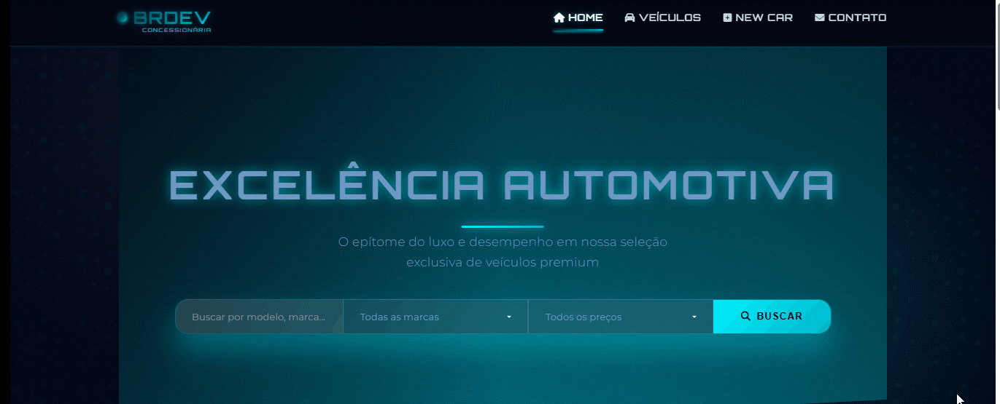

# BRDEV_CAR

# 🚗 BrDev Car

**BrDev Car** é uma plataforma web desenvolvida com Django, onde o **admin** pode cadastrar carros premium para venda. O projeto está em evolução e permitirá que usuários também anunciem seus próprios veículos após se cadastrarem.

---

## ✨ Funcionalidades atuais

- Cadastro e listagem de carros de luxo
- Página de detalhes do carro
- Formulário para contato com o vendedor
- Área administrativa (Django Admin)

---

## 🛠 Tecnologias utilizadas

- Python 3
- Django
- HTML/CSS
- SQLite (banco de dados padrão)

---

## 📧 Contato com o vendedor

Ao acessar a página de um carro, o visitante pode preencher um formulário para entrar em contato com o anunciante.
---

## 🚧 Próximas funcionalidades
Sistema de login e cadastro de usuários

Área para usuários anunciarem seus próprios carros

Filtros por marca, modelo, preço e ano

---

## 📌 Status

🚧 Projeto em desenvolvimento

  

